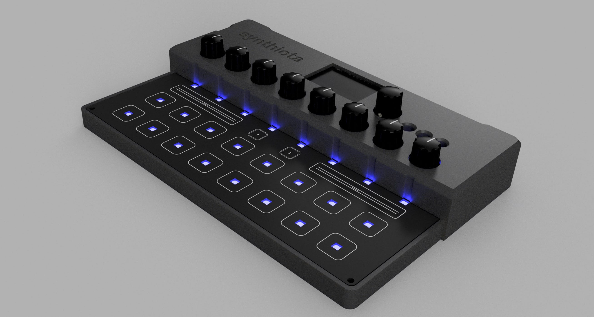
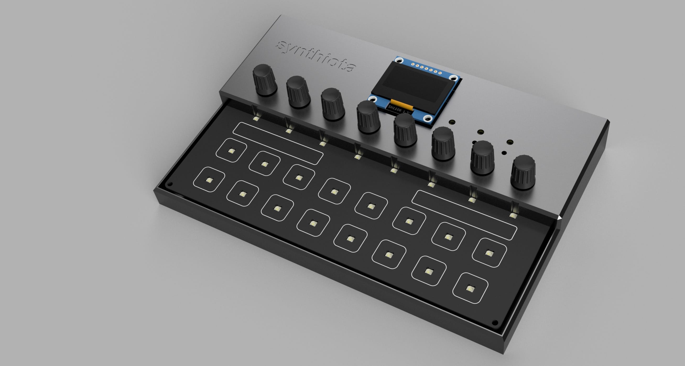
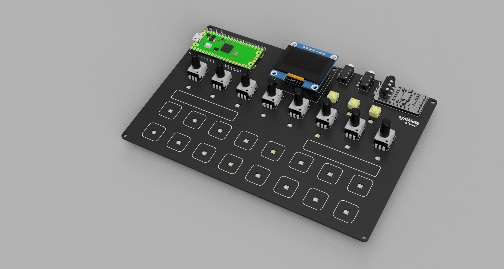

# synthiota

Pico/Pico2-based board for playing with synthesizers in CircuitPython.

https://github.com/user-attachments/assets/1fe45b23-2a2a-41f4-9afe-203840c703e8

# Assembling

The PCBAs come with all SMD parts assembled. The components you will need to supply:

- 1 x Raspberry Pi Pico 2
- 1 x [PCM5102 I2S Stereo DAC](https://amzn.to/4nX4xkD)
- 1 x [SH1106 128x64 1.3" SPI OLED](https://amzn.to/3JZ7GCK)
- 2 x [PJ320A 3.5mm stereo jack](https://amzn.to/4i5F33d)
- 8 x [RK09K 10k vertical potentiometer](https://amzn.to/47XbwEk) (or similar)
- 1 x [EC11 rotary encoder](https://amzn.to/4o1vSSW)

You will also need some headers and header sockets to attach the modules to the PCB.
If using the [enclosure](./enclosure), the top part expects the header arrangement to be:

- Pico: 
  - Standard header pins on Pico  (Pico H sold w/ these pins soldered)
  - [Short socket headers](https://www.adafruit.com/product/5585) for Pico on synthiota board
- OLED display:
  - Standard header pins on OLED display  (usually sold w/ these pins soldered)
  - [Short socket headers](https://www.adafruit.com/product/5585) for OLED display on synthiota board
- PCM5102 I2S DAC
  - Standard header pins on PCM5102 I2S DAC board (usually sold w/ these pins soldered)
  - I2S DAC w/ header pins is soldered directly to the synthiota board, no socket

(most links are Amazon affiliate links)

