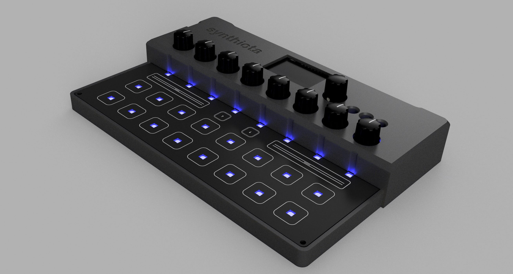
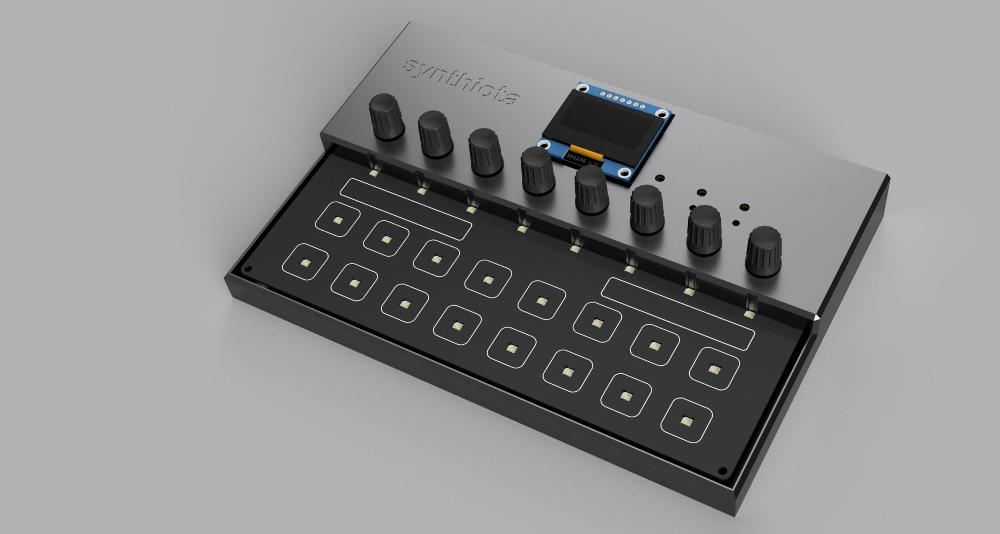
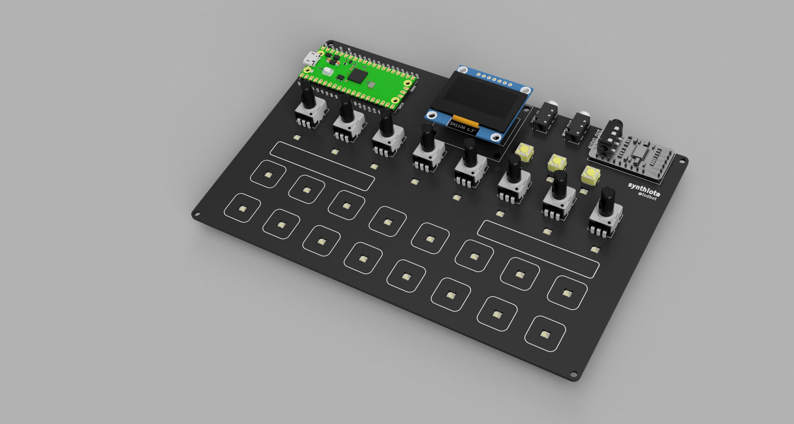
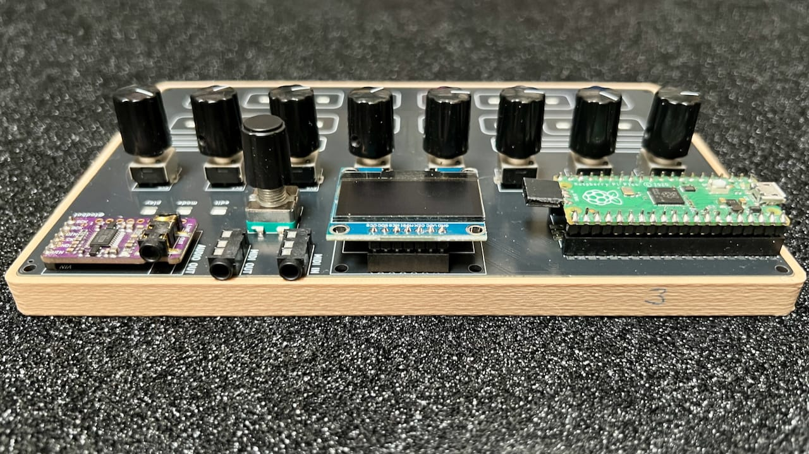
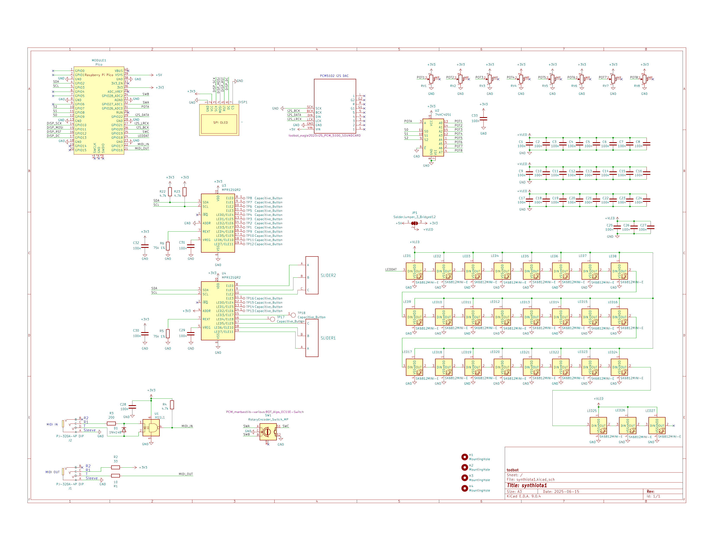

# synthiota

Pico/Pico2-based board for playing with synthesizers in CircuitPython.

https://github.com/user-attachments/assets/1fe45b23-2a2a-41f4-9afe-203840c703e8

## Video demos:

- "tbish" TB-303 like synth, demo2: https://youtu.be/MjE2wdevc3M
- "tbish" TB-303 like synth, demo1: https://youtu.be/O4a5pk78DVM

# Assembling

The PCBAs come with all SMD parts assembled. The components you will need to supply:

- 1 x Raspberry Pi Pico 2
- 1 x [PCM5102 I2S Stereo DAC](https://amzn.to/4nX4xkD)
- 1 x [SH1106 128x64 1.3" SPI OLED](https://amzn.to/4oUlOeM) 
- 2 x [PJ320A 3.5mm stereo jack](https://amzn.to/4i5F33d)
- 8 x [RK09K 10k vertical potentiometer](https://amzn.to/47XbwEk) (or similar)
- 1 x [EC11 rotary encoder](https://amzn.to/4o1vSSW)

You will also need some headers and header sockets to attach the modules to the PCB.
If using the [enclosure](./enclosure), the top part expects the header arrangement to be:

- Pico: 
  - Standard header pins on Pico  (Pico H sold w/ these pins soldered)
  - [Short socket headers](https://www.adafruit.com/product/5585) for Pico on synthiota board
- OLED display:
  - Standard header pins on OLED display  (usually sold w/ these pins soldered)
  - [Short socket headers](https://www.adafruit.com/product/5585) for OLED display on synthiota board
- PCM5102 I2S DAC
  - Standard header pins on PCM5102 I2S DAC board (usually sold w/ these pins soldered)
  - I2S DAC w/ header pins is soldered directly to the synthiota board, no socket

(most links are Amazon affiliate links)

# Pico pins used

CircuitPython naming. See `hwtest/synth_setup_synthiota.py` for how they're used.

Encoder 

* `board.GP28`  - encoder B pin
* `board.GP27`  - encoder A pin

ADC input for pots

* `board.GP26`  - ADC input for pot knobs

I2S DAC 

* `board.GP22`  - I2S DAT pin to PCM5102 DAC
* `board.GP21`  - I2S LCK pin to PCM5102 DAC
* `board.GP20`  - I2S BCK pin to PCM5102 DAC

Encoder switch

* `board.GP19`  - encoder SW pin
 
NeoPixel LEDs
 
* `board.GP18`  - NeoPixel LEDs pin 
 
UART MIDI In/Out
 
* `board.GP17`  - UART RX pin to MIDI input
* `board.GP16`  - UART TX pin to MIDI output

SPI for display

* `board.GP13`  - SPI DC for SH1106 display
* `board.GP12`  - SPI RES for SH1106 display
* `board.GP11`  - SPI MOSI for SH1106 display
* `board.GP10`  - SPI SCK for SH1106 display

Pot mux select

* `board.GP9`   - SEL A pin to 4051 mux for pot knobs
* `board.GP8`   - SEL B pin to 4051 mux for pot knobs
* `board.GP7`   - SEL C pin to 4051 mux for pot knobs

I2C for MPR121 touch sensors

* `board.GP3`   - I2C SCL to MPR121 touch sensors
* `board.GP2`   - I2C SDA to MPR121 touch sensors

Free pins: GP0,GP1, GP4,GP5,GP6, GP14,GP15. Feel free to use for other purposes. 

# Schematics

